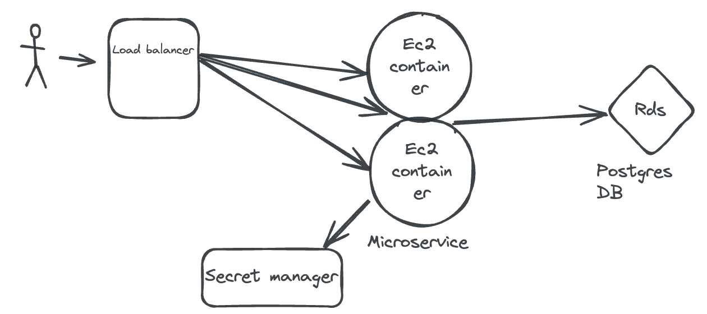

# Go API Application

This repository contains a Go API application that interacts with a PostgreSQL database and is deployed using AWS CloudFormation. The application provides endpoints to manage user information, specifically their date of birth, and returns customized messages based on the provided data. This project was created as an exercise for an interview.

## Warning

- This system does not contain an authentication system, as it is intended as a playground. Use with caution and do not deploy in a production environment without adding proper authentication and security measures.
- The load balancer is, by default, open to accept connections from everywhere. Ensure to add appropriate security group rules for production use.
- We are installing everything using the user data when the instances launch. This is due to this being a playground. In a production scenario, we would bake previously an AMI with all the needed content.
- In a production scenario, we would also add an API Gateway, as there could be several microservices serving different endpoints.

## Architecture



## Repository Structure

```plaintext
.
├── .github
│   └── workflows
│       └── cicd.yaml                # GitHub Actions workflow for CI/CD
├── cloudformation
│   └── template.yaml                # CloudFormation template for deploying infrastructure
├── images
│   └── diagram.png                  # Architecture diagram
├── scripts                          # Directory for scripts
│   └── setup.sh                     # Setup script
├── docker                           # Docker-related files
│   ├── Dockerfile                   # Dockerfile for building the image
│   └── docker-compose.yml           # Configuration for running the application and its dependencies using Docker Compose
├── config                           # Configuration files
│   ├── config.json                  # Configuration file used in the GitHub Actions workflow
│   └── README.md                    # README for the config directory
├── .gitignore                       # Git ignore file
├── README.md                        # This README file
├── api.go                           # Main Go application file
├── api_test.go                      # Unit tests for the application
└── api_acceptance_test.go           # Acceptance tests for the application
```

## Prerequisites

	•	Docker
	•	Docker Compose
	•	AWS CLI
	•	Go 1.19


## Setting Up the Project
Clone the Repository

```bash
git clone https://github.com/sciclon2/revolut.git
```

## Setup environment
```bash
./scripts/setup.sh
```

## Build and Run Locally with Docker
You can build and run the application locally using Docker and Docker Compose.

1.	Build and start the services:
```bash
docker-compose -f docker/docker-compose.yml down -v
docker-compose -f docker/docker-compose.yml up --build
```

2.	The API will be accessible at http://localhost:8080.

## Run Tests
Unit tests

To run unit tests, use the following command:
```bash
go test -v -tags=unit ./...
```

## Acceptance Tests
To run acceptance tests, ensure the Docker containers are running:
```bash
./scripts/setup_ssl_postgres.sh
docker-compose -f docker/docker-compose.yml down -v
docker-compose -f docker/docker-compose.yml up -d
go test -v -tags=acceptance ./...
docker-compose -f docker/docker-compose.yml down -v
```


## Deployment
## Configuration

The config/config.json file is used to configure the AWS deployment parameters:

```bash
{
  "aws_region": "eu-central-1",
  "vpc_id": "vpc-xxxx",
  "subnets": ["subnet-xxxx", "subnet-xxxx", "subnet-xxxx"],
  "key_name": "devops",
  "ami_id": "ami-xxxx"
}
```

## GitHub Actions
The CI/CD pipeline is defined in .github/workflows/cicd.yaml. It includes the following steps:

	•	Checkout code
	•	Set up Go
	•	Initialize and tidy Go module
	•	Run unit tests
	•	Run acceptance tests
	•	Build and push Docker image to Docker Hub
	•	Deploy the CloudFormation stack

## Setting up GitHub Secrets
You need to set up the following GitHub secrets for the CI/CD pipeline to work:

	•	AWS_ACCESS_KEY_ID: Your AWS access key ID.
	•	AWS_SECRET_ACCESS_KEY: Your AWS secret access key.
	•	DOCKER_USERNAME: Your Docker Hub username.
	•	DOCKER_PASSWORD: Your Docker Hub password.

These AWS credentials are needed for managing AWS resources via CloudFormation, and the Docker credentials are needed to upload the Docker image.


## CloudFormation
The CloudFormation template (cloudformation/template.yaml) sets up the necessary infrastructure:

	•	VPC
	•	Subnets
	•	Security Groups
	•	RDS instance
	•	EC2 instances
	•	Load Balancer

## Database Secrets Management

The database username and password are generated and managed using AWS Secrets Manager. The CloudFormation template includes a DBSecret resource that generates a random password and stores it securely. The application retrieves these secrets at runtime to connect to the database.


## Deploy the Application
On a new release, the GitHub Actions workflow will automatically deploy the application. The deployment steps include:

	1.	Reading the configuration file.
	2.	Configuring AWS credentials.
	3.	Deploying the CloudFormation stack.
	4.	Fetching the Load Balancer DNS name and providing the access URL.

The application will be accessible at the Load Balancer DNS name provided after the deployment.


## Deployment Based on Auto Scaling Group Changes

The deployment is based on the Auto Scaling Group (ASG) detecting a change in the launch template. When we bake a new stable container, this will change a parameter of the CloudFormation stack, which will trigger the ASG to replace the instances using the updated launch configuration. This policy provides the flexibility to specify whether CloudFormation replaces instances in an Auto Scaling group in batches or all at once without replacing the entire resource.

## API Endpoints
Health Check

	•	URL: /health
	•	Method: GET
	•	Response: { "status": "ok" }

Get User

	•	URL: /hello/{username}
	•	Method: GET
	•	Response: { "message": "Hello, {username}! Your birthday is in {days} days." } or { "message": "Happy Birthday, {username}!" }

Create/Update User

	•	URL: /hello/{username}
	•	Method: PUT
	•	Request Body: { "dateOfBirth": "YYYY-MM-DD" }
	•	Response: 201 Created or 200 OK

